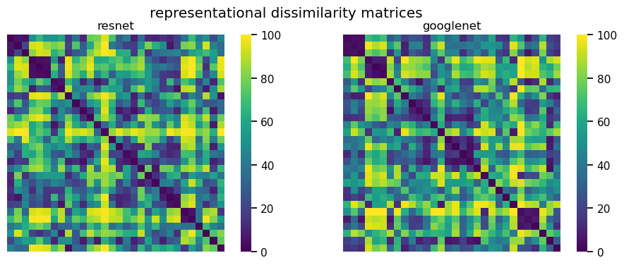
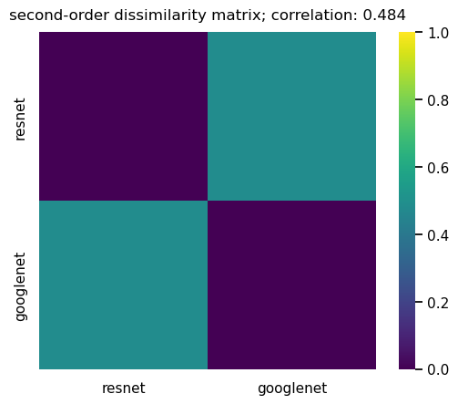

# Simple Example of Representational Similarity Analysis (RSA)

## Introduction

This repository provides a minimal, self-contained Jupyter notebook (`rsa_test.ipynb`) demonstrating a simple Representational Similarity Analysis (RSA).

The analysis compares the internal representations of two pre-trained convolutional neural networks (CNNs), [ResNet-18](https://en.wikipedia.org/wiki/Residual_neural_network) and [GoogLeNet](https://en.wikipedia.org/wiki/Inception_(deep_learning_architecture)#Inception_v1), to see how similarly they "understand" the relationships between images. The [MNIST](https://en.wikipedia.org/wiki/MNIST_database) dataset is used as the set of input stimuli.

## Core Workflow

1. Load pre-trained resnet18 and googlenet.

2. Sample 30 images from MNIST (3 images for each of the 10 digits).

3. Extract the penultimate layer features (activations) for these 30 images from both models.

4. Calculate a 30x30 Representational Dissimilarity Matrix (RDM) for each model using pairwise Euclidean distance.

5. Plot these first-order RDMs.

6. Compare the two RDMs using Spearman rank correlation to get a "second-order" similarity, and plot the result.

## Repository Structure

`rsa_test.ipynb`: The main Jupyter notebook containing all code for data loading, model feature extraction, RDM calculation, and plotting.

## Interpretation of Plots

The notebook generates two main visualizations:

1. Representational Dissimilarity Matrices (RDMs)



This plot shows the 30x30 RDMs for both models as heatmaps.

- Observation: Both heatmaps display a very clear 10x10 blocky structure.

- Interpretation: This structure directly corresponds to the 10 digit classes (0-9). The images were sampled in order (three '0's, three '1's, etc.). The dark 3x3 squares along the main diagonal represent low dissimilarity (high similarity) between images of the same digit, especially for digits 0, 1, 3, 5, 6, 8. The lighter squares off-diagonal represent high dissimilarity (low similarity) between images of different digits. This visually confirms that both models effectively separate the 10 digit classes in their feature representations.

2. Second-Order Dissimilarity Matrix



This 2x2 heatmap compares the two RDMs against each other. It's a "similarity of similarities" analysis.

- Observation: The matrix is generated by calculating the Spearman rank correlation between the flattened RDMs and then converting that to a dissimilarity score (specifically, 1 - correlation).

- Interpretation: This single value of ca. 0.484 quantifies how similarly the two models organize their internal representations. It indicates that the two models, ResNet-18 and GoogLeNet, have a moderately similar "representational geometry."

## How to Run

Ensure you have `conda` installed. Create and activate the environment using the `requirements.txt` file:

``` bash
conda create --name rsa-env --file requirements.txt
conda activate rsa-env
```
Run the Jupyter notebook:

```bash
jupyter notebook rsa_test.ipynb
```
